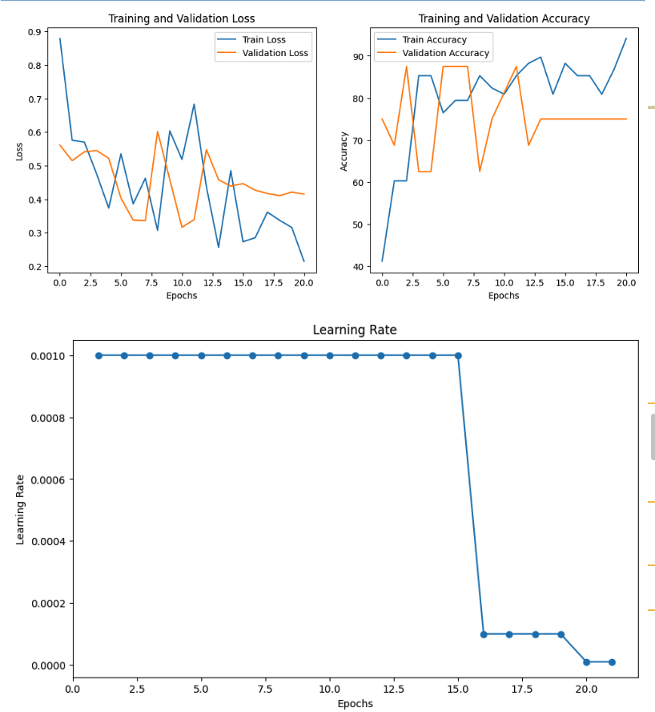
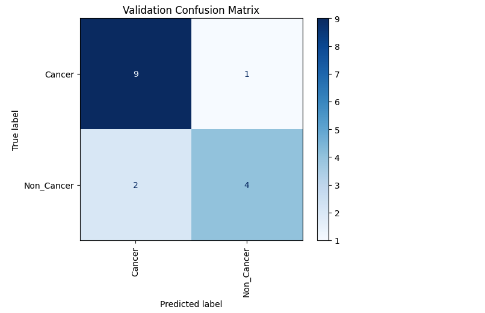

## Skin Cancer Classification Using Transfer Learning (ResNet18)

**Binary Image Classification: Cancer vs. Non-Cancer**

### Project Overview

Skin cancer is one of the most common types of cancer globally, and early detection greatly improves patient outcomes. Dermatologists visually inspect skin lesions, but diagnosing accurately can be subjective and dependent on expertise. The goal of this project is to build a machine learning model capable of distinguishing between cancerous and non-cancerous skin lesions from dermatoscopic images.

This project applies transfer learning using ResNet18 and employs model fine-tuning, normalization, learning rate scheduling, and early stopping to produce a clinically relevant classification pipeline.

### Dataset

Source: https://www.kaggle.com/datasets/kylegraupe/skin-cancer-binary-classification-dataset/data (re-organized into train and test)

**Classes:**

Cancer

Non_Cancer

Images were stored in varying formats and illumination conditions.

Split	Count	Notes
Train	84 images	Balanced across classes
Validation	16 images	Created from train set (80/20 split)
Test	204 images	Used only for final evaluation

**Because medical datasets are often small and imbalanced, this project emphasizes:**
Normalization
Transfer learning
Careful validation

### Data Preprocessing
Transformations Applied
transforms.Compose([
    ConvertToRGB(),                 
    transforms.Resize((224, 224)),  
    transforms.ToTensor(),
    transforms.Normalize(mean, std) 
])

Dataset Normalization

To standardize pixel intensity variations:

Mean: tensor([0.6265, 0.4395, 0.3652])
Std:  tensor([0.1900, 0.1746, 0.1637])

Model Architecture

The model is built on ResNet18, chosen due to:

Small size medical datasets

Reduced complexity compared to deeper networks (ResNet50/101)

Transfer Learning Strategy

### Training Results

Training accuracy improved steadily.

Validation accuracy fluctuated but converged.

Learning rate was reduced automatically after plateau.

### Validation Performance (16 images)
| Class       | Precision | Recall | F1-score |
|-------------|-----------|--------|----------|
| Cancer      | 0.8182    | **0.9000** | 0.8571 |
| Non_Cancer  | 0.8000    | 0.6667 | 0.7273 |

**Validation Accuracy: 81.25%**

Cancer detection sensitivity is strong **(recall = 90%)**
Model occasionally misclassifies Non-Cancer as Cancer; acceptable in a clinical triage context (false alarms > missed cancers).

### Test Performance (Real-World Evaluation 204 images)

| Class       | Precision | Recall | F1-score |
|-------------|-----------|--------|----------|
| Cancer      | 0.4211    | **0.9524** | 0.5839 |
| Non_Cancer  | **0.9817**| 0.6605 | 0.7897 |

**Test Accuracy: 72.06%**

### Interpretation

Model is extremely cautious and prioritizes identifying cancer:

It rarely misses cancer (recall = 95%).

But this comes at the cost of extra false positives.

Clinically, this is desirable — in medical screening,
→ Missing a cancer case is more dangerous than raising false alarms.

### Strengths and Limitations
**Strengths**

Strong cancer detection sensitivity.

Good use of transfer learning with frozen backbone.

Well-structured pipeline with normalization & scheduling.

Early stopping prevents overfitting.

**Limitations**

Training dataset is small → model variance is high.

Needs more Non-Cancer sample diversity to reduce false positives.

Data augmentation was not utilized — could improve robustness.

### Conclusion

This project demonstrates a practical machine learning pipeline for skin cancer detection using ResNet18 transfer learning. The model prioritizes patient safety by achieving high cancer detection recall, making it suitable as a pre-screening aid for dermatologists or clinical assistants.
